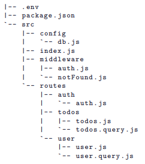
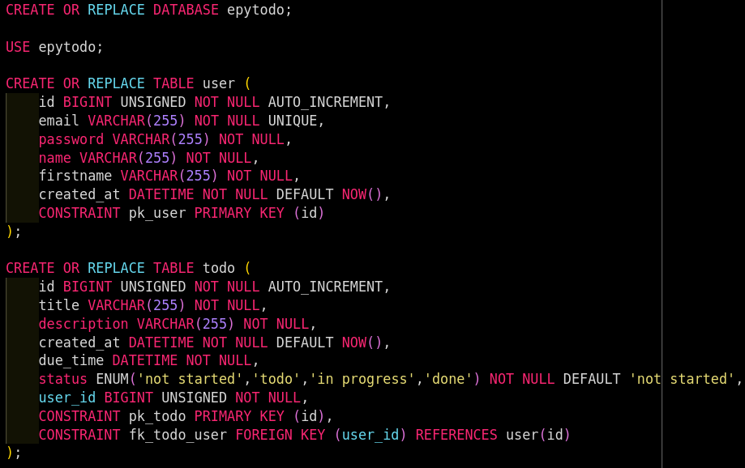
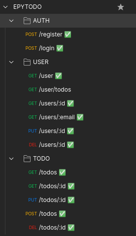

# EpyTodo

## Warning :warning:

I want to specify that for this project, \
I was a beginner in programming.\
Moreover, I had never used JavaScript,\

## Description :sunrise_over_mountains:

The project idea is to build a Todo List. \
Thanks to it, you’ll be able to handle all the tasks you need to do easily! \
We will mainly focus on the “backend” side of the project,\
Within this project, you’ll have to develop:\
    &nbsp;&nbsp;&nbsp;&nbsp;&nbsp;&nbsp;1. your MySQL database.\
    &nbsp;&nbsp;&nbsp;&nbsp;&nbsp;&nbsp;2. A web server using Node.js


Here is the architecture I set up for the project :

<p align="center">
    <br/>
  
  <br/>
  <br/>
</p>

We also made a SQL script to create the database quickly :

<p align="center">
    <br/>
  
  <br/>
  <br/>
</p>

## How To Use :mag_right:

* Git clone the repositery :<br /> 
```
git clone git@github.com:Kcarttigueane/TASK-MANAGER.git
```
* First build the project executing : <br />
```
make
```
* Run the program :<br />
```
npm run watch
```

## Start project :checkered_flag:

You can use curl to perform your queries afterwards \
or use the repository's postman collection which has all possible queries

## Bonus :package:

As a bonus, I have created a postman collection that allows you to test all the requests of the project,\
feel free to use it if you need it.

<p align="center">
    <br/>
  
  <br/>
  <br/>
</p>


------------
## Maintainers :sunglasses:

 - [Kevin CARTIGUEANE](https://github.com/Kcarttigueane)
